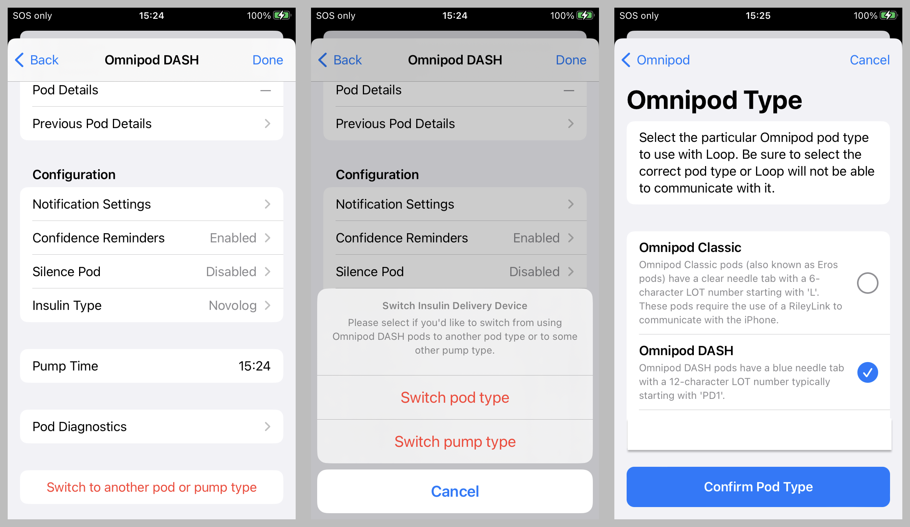

# OmnipodKit

A universal Omnipod pump manager to (eventually) handle all Insulet Omnipod pod types.
Note that this is an evolving prototyping work -- use at your own risk!

When doing an "Add Pump", select "All Omnipod Types" to select the new OmnipodKit pump manager.
The actual Omnipod pod type will be selected during the pump manager initialization sequence.
When deactivating a pod in the OmnipodKit pump manager,
you can switch to using either a different pod type OR another different pump manager
by scrolling to the bottom of the pump settings view and tapping on "Switch to another pod or pump type".

The "Omnipod" (OmniKit) and "Omnipod DASH" (OmniBLE) pump managers displayed by "Add Pump"
are still the original unmodified pump managers which maintain their own separate pump manager state.
Therefore if you already have an active pod session using a previous pump manager,
you must select "Switch to other insulin delivery device" after deactivating the pod
before you can select this new universal Omnipod pump manager by selecting "All Omnipod Types".

Eventually the OmniKit and OmniBLE pump managers and their associated plugins should be totally replaced by OmnipodKit.



## Status

### March 14, 2025

A short-term goal of this effort is to replace both the OmniKit and OmniBLE Pump Managers
with a single universal Pump Manager which can handle all Omnipod pod types
to simplify future DIY Omnipod code maintenance and to improve the user
experience when switching between different Omnipod pod types.
The longer-term goal is that this Omnipod Pump Manager will be extended
to provide Omnipod 5 support as a third pod type option for both Loop and Trio.
At this time, there is nothing implementing Omnipod 5 communications
which is still trying to be understood by the DIY community.
The O5 code is temporary placeholder and verifcation code using the DASH transport
to test having a third pod type showing new Omnipod 5 UI additions
(different text, pod tab color, etc)
and using an alternate base pod id in the pod comms.
For DIY use, the Omnipod 5 pod ids will start with 0x15
while the DIY DASH pod ids start with 0x17 and
Eros addresses (pod ids) for both DIY and PDM use always start with 0x1F.

The pump settings show the name of the selected pod type.
Pod Diagnostics -> Pump Manager Details can be used
to examine the attributes of the new unified Pump Manager & pod state used by OmnipodKit.

### To Do

Figure out future migration aids to help transition pod use
to OmnnipodKit while depricating use of OmniKit and OmniBLE.

## To Add to any modern Loop Workspace

Temporary install instructions.

```quote
$ cd <the-top-of-LoopWorkspace-directory>
$ git clone https://github.com/loopandlearn/OmnipodKit.git
$ xed .

In Xcode, select File->'Add Files to "LoopWorkspace"...'
Scroll down to select and double click to open the "OmnipodKit" directory
Select the "OmnipodKit.xcodeproj" file and tap the blue (Add) button
Leave the Action as "Reference files in place"
Tap the blue (Finish) button

In Xcode with the LoopWorkspace selected, select Product->Scheme->Edit Scheme...
Make sure that the Build tab on the top of the left panel is selected
Click on the "+" in the bottom left corner above the blue (Duplicate Scheme) button
Scroll down to select "OmnipodKitPlugin" icon (under OmnipodKit) and tap the blue (Add) button
Drag "OmnipodKitPlugin OmnipodKit" from the bottom of the list up until immediately before "OmniKitPlugin OmniKit"
Tap (Close)
```
After signing and building Loop, be sure to select the new "All Omnipod Types"
when doing an "Add Pump" to use the new OmnipodKit pump manager.

To add the OmniTests to the LoopWorkspace tests,
verify that the LoopWorkspace is selected,
click on the diamond with the check near the top
of the lefthand panel to display the Test Navigator panel,
long press on OmniTests under the "Other Tests" section near the end of the panel,
and then select "Add to LoopWorkspace".

## To Add to Trio-dev

Unfortunately Trio has requires editing parts of the Trio code to incorporate any Pump Manager Plugin, and even more edits are required for successful addition of an Omnipod Pump manager (OmniBLE, OmniKit or OmnipodKit).

The OmnipodKit (private repo) has been successfully added and tested with the closed-beta Trio-dev (private repo).

It is expected that the Trio-dev repository will become public before the OmnipodKit repo, so only the patch needed for Trio-dev is included in this README file.

1. Download the patch, add_omnipodkit_to_Trio-dev.patch, in the patch folder of this repository
2. Nagivate to the Trio-dev folder in your local clone
3. Issue the command below

```
git apply ~/Downloads/add_omnipodkit_to_Trio-dev.patch
```
